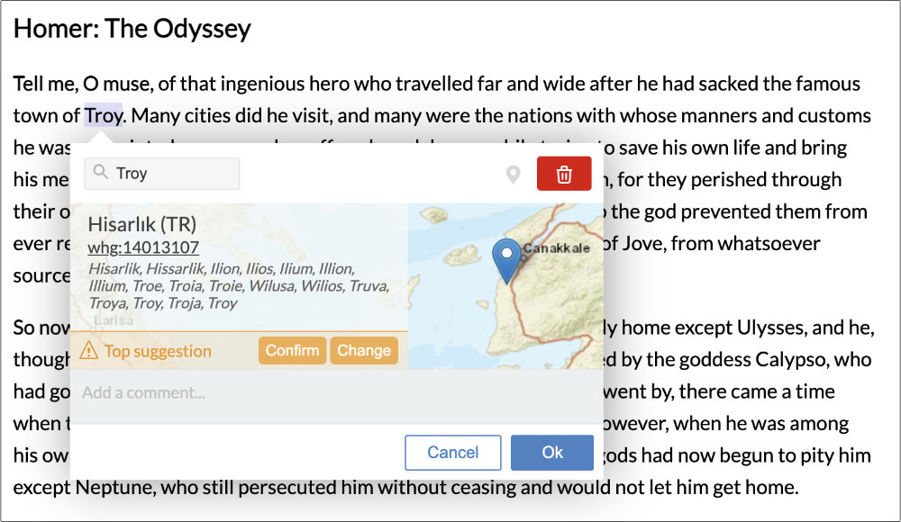
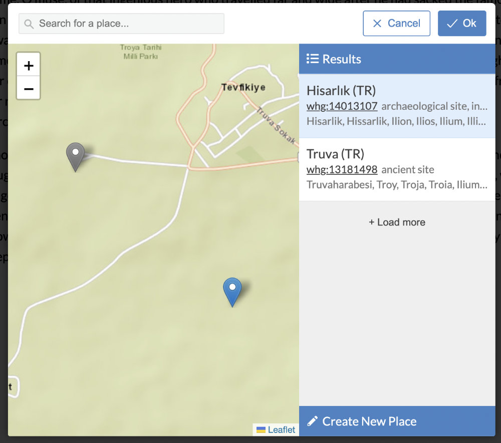
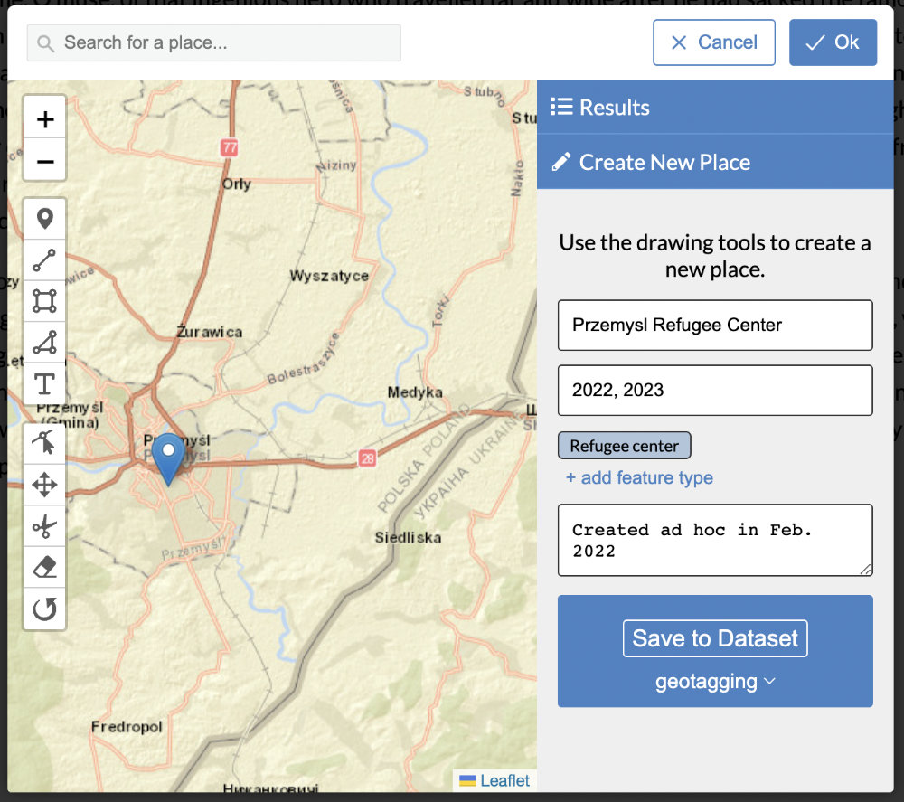
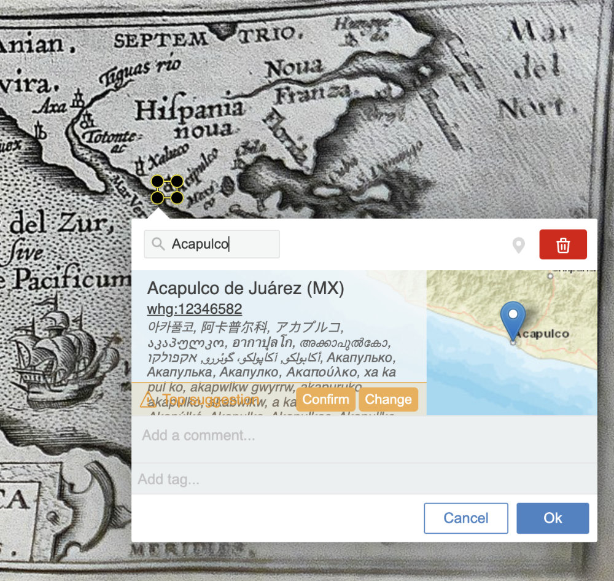

# Recogito WHG Geotagging Widget

A geotagging extension to the [RecogitoJS](https://github.com/recogito/recogito-js) and [Annotorious](https://annotorious.com) annotation tools for linking annotations to the World Historical Gazetteer. Derived from the [Recogito Geotagging Widget](https://github.com/recogito/geotagging-widget).

__Features:__

- Search the WHG gazetteer index and link your annotations to WHG gazetteer URI
- Use advanced search to browser WHG search suggestions, including suggestions from WHG's fuzzy search
- Create new places in a WHG dataset with the built-in drawing tools

 
Fig. 1 - Search presents top suggestion, constrained here by relevent WHG study area.


Fig. 2 - If top suggestion is incorrect, review others with options to extend search as 'fuzzy' ("Load more") and/or create new record.


Fig. 3 - Create new Place feature and add to existing WHG dataset owned by user. Pre-filled per-document dates can be modified in the form.


Fig. 4 - Similar functionality is available for Annotorious image annotation.


## Online demos:

**NOTE:** The API on the World Historical Gazetteer site enabling this functionality is in beta. The place creation function of these working demos writes to an example WHG dataset named 'geotagging'. To view the contents of that dataset on the WHG site, you must be added as a "collaborator." Please email karl [at] kgeographer.org to request enabling that GUI read access, or to request full use permissions of the remote API.

- [Text annotation with RecogitoJS](https://worldhistoricalgazetteer.github.io/recogito-whg-widget/)
- [Image annotation with Annotorious](https://worldhistoricalgazetteer.github.io/recogito-whg-widget/annotorious.html)

## Usage

To use the plugin in you own website, include `geotagging-widget.js` script into your page, alongside Annotorious or RecogitoJS. Initialize the plugin like so:

```
<!DOCTYPE html>
<html>
  <head>
    <meta charset="utf-8" />
    <title>RecogitoJS | Development</title>
    <link href="https://fonts.googleapis.com/css?family=Lato&display=swap" rel="stylesheet">
    <link href="https://cdn.jsdelivr.net/npm/@recogito/recogito-js@1.7.1/dist/recogito.min.css" rel="stylesheet">
    <script src="https://cdn.jsdelivr.net/npm/@recogito/recogito-js@1.7.1/dist/recogito.min.js"></script>
    <script src="geotagging-widget.js"></script>

    <style>
      html, body {
        padding:10px 20px;
        margin:0;
      }

      h1 {
        font-size:22px;
        margin-top:30px;
        margin-bottom:20px;
      }

      #content {
        max-width:920px;
        font-family:'Lato', sans-serif;
        font-size:17px;
        line-height:27px;
      }
    </style>
  </head>
  <body>
    <div id="content" class="plaintext">
      <h1>Homer: The Odyssey</h1>
      <p>
        <strong>Tell me, O muse,</strong> of that ingenious hero who travelled far and wide after he had sacked
        the famous town of Troy. Many cities did he visit, and many were the nations with whose manners and customs
        he was acquainted; moreover he suffered much by sea while trying to save his own life and bring his men safely
        home; but do what he might he could not save his men, for they perished through their own sheer folly in eating
        the cattle of the Sun-god Hyperion; so the god prevented them from ever reaching home. Tell me, too, about all
        these things, O daughter of Jove, from whatsoever source you may know them.
      </p>
      <p>
        <strong>So now all who escaped death in battle</strong> or by shipwreck had got safely home except Ulysses,
        and he, though he was longing to return to his wife and country, was detained by the goddess Calypso, who
        had got him into a large cave and wanted to marry him. But as years went by, there came a time when the gods
        settled that he should go back to Ithaca; even then, however, when he was among his own people, his troubles
        were not yet over; nevertheless all the gods had now begun to pity him except Neptune, who still persecuted
        him without ceasing and would not let him get home.
      </p>
    </div>
    <script type="text/javascript">
      window.onload = function() {
        const config = {
          tileUrl: 'https://server.arcgisonline.com/ArcGIS/rest/services/World_Street_Map/MapServer/tile/{z}/{y}/{x}',
          // authenticate to WHG w/per-user token
          token: '1b7be4ea1d84020e483065524b3ccbcf15c18b17',
          // per-document year or year-pair timespan
          when: [-700, -800],
          // WHG Study Area id to constrain searches
          area: 412
        };

        var r = Recogito.init({
          content: 'content',
          allowEmpty: true,
      	  widgets: [
            { widget: recogito.GeoTagging(config) },
            { widget: 'COMMENT' },
          ]
        });

        r.on('createAnnotation', function(a) {
          console.log('created', a);
        });

        r.on('updateAnnotation', function(annotation, previous) {
          console.log('updated', previous, 'with', annotation);
        });

        r.on('deleteAnnotation', function(annotation) {
          console.log('deleted', annotation);
        });
      };
    </script>
  </body>
</html>
```

## License

[BSD 3-Clause](https://github.com/recogito/geotagging-widget/blob/main/LICENSE)