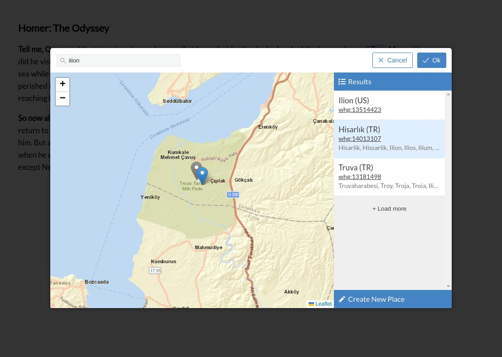
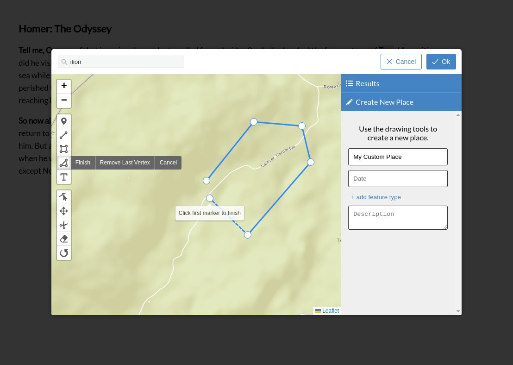

# Recogito WHG Geotagging Widget

An geotagging extension to the [RecogitoJS](https://github.com/recogito/recogito-js) and [Annotorious](https://annotorious.com) annotation tools for linking annotations to the World Historical Gazetteer. Derived from the [Recogito Geotagging Widget](https://github.com/recogito/geotagging-widget).

__Features:__
- Search the WHG gazetteer index and link your annotations to WHG gazetteer URIs
- Use advanced search to browser WHG search suggestions, including suggestions from WHG's fuzzy search
- Create new places with the built-in drawing tools





## Online demos:

- [Text annotation with RecogitoJS](https://worldhistoricalgazetteer.github.io/recogito-whg-widget/)
- [Image annotation with Annotorious](https://worldhistoricalgazetteer.github.io/recogito-whg-widget/annotorious.html)

## Usage

To use the plugin in you own website, include `geotagging-widget.js` script into your page, alongside Annotorious or RecogitoJS. Initialize the plugin like so:

```html
<!DOCTYPE html>
<html>
  <head>
    <!-- Include RecogitoJS script + styles -->
    <script src="https://cdn.jsdelivr.net/npm/@recogito/recogito-js@latest/dist/recogito.min.js"></script>
    <link href="https://cdn.jsdelivr.net/npm/@recogito/recogito-js@latest/dist/recogito.min.css" rel="stylesheet">

    <!-- Include WHG geotagging widget -->
    <script src="geotagging-widget.js"></script>
  </head>

  <body>
    <div id="content">
      <h1>Homer: The Odyssey</h1>
      <p>
        <strong>Tell me, O muse,</strong> of that ingenious hero who travelled far and wide 
        after he had sacked the famous town of Troy. Many cities did he visit, and many were 
        the nations with whose manners and customs he was acquainted; moreover he suffered 
        much by sea while trying to save his own life and bring his men safely home; but do 
        what he might he could not save his men, for they perished through their own sheer 
        folly in eating the cattle of the Sun-god Hyperion; so the god prevented them from 
        ever reaching home. Tell me, too, about all these things, O daughter of Jove, from 
        whatsoever source you may know them.
      </p>
    </div>

    <script type="text/javascript">
      window.onload = function() {
        // Geotagging widget configuration
        const config = {
          // WHG API base URL. Default:
          baseURL: 'https://whgazetteer.org/api/remote/',

          // The raster basemap to use. Default:
          tileUrl: 'https://{s}.tile.openstreetmap.org/{z}/{x}/{y}.png',

          // Default zoom of the widget mini-map. Default:
          defaultZoom: 7
        };

        var r = Recogito.init({
          content: 'content',
      	  widgets: [
            // Init the widget
            { widget: recogito.GeoTagging(config) },
            { widget: 'COMMENT' },
          ]
        });
      };
    </script>
  </body>
</html>
```

## License

[BSD 3-Clause](https://github.com/recogito/geotagging-widget/blob/main/LICENSE)